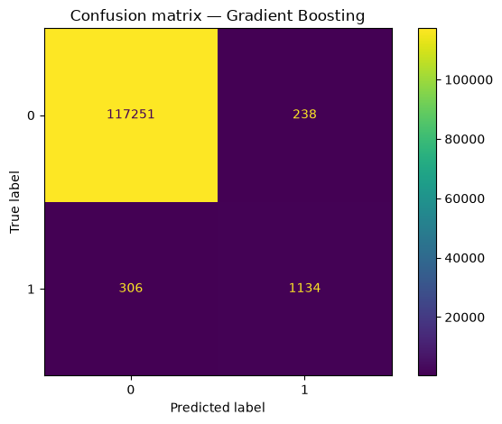
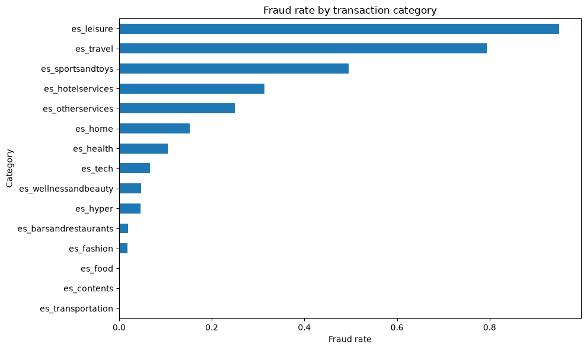
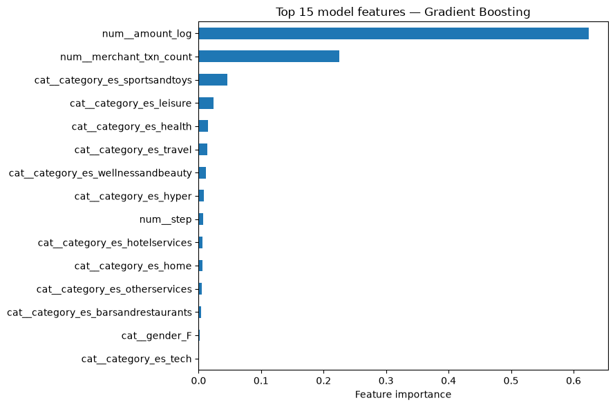
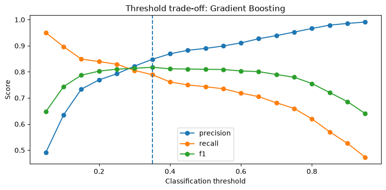

# Fraud Detection with Machine Learning

[](https://www.python.org/)
[](./fraud-detection-analysis.ipynb)
[](https://scikit-learn.org/)
[](./DATASET_LICENSE.md)

An end-to-end machine-learning project for detecting fraudulent transactions in the highly imbalanced **BankSim** synthetic payment dataset. The analysis compares three classifiers, tunes the decision threshold on validation data, and evaluates the selected model once on an untouched test set.

**[Explore the executed notebook](./fraud-detection-analysis.ipynb)**

## Results at a glance

Gradient Boosting achieved the highest validation F1 and was selected with a probability threshold of **0.35**.

| Test metric | Score |
|---|---:|
| Precision | 0.8265 |
| Recall | 0.7875 |
| F1 | 0.8065 |
| ROC-AUC | 0.9973 |
| PR-AUC | 0.8943 |

The final model correctly identified **1,134 of 1,440** fraudulent transactions in the test set, with **238 false positives**.



## Why this project matters

Only **1.21%** of the transactions are fraudulent, so accuracy alone would be misleading. This project emphasizes precision, recall, F1, ROC-AUC, and especially PR-AUC, while making the decision threshold an explicit modeling choice.

The workflow demonstrates:

- leakage-safe feature engineering learned only from training data;
- stratified train, validation, and test splits;
- preprocessing with imputation, scaling, and one-hot encoding;
- comparison of Logistic Regression, Random Forest, and Gradient Boosting;
- validation-only model and threshold selection;
- final evaluation on a previously untouched test set.

## Dataset

The included `fraud.csv.zip` contains the BankSim synthetic transaction dataset. Extract it to produce the `fraud.csv` file expected by the notebook.

| Property | Value |
|---|---:|
| Transactions | 594,643 |
| Features plus target | 10 |
| Legitimate transactions | 587,443 |
| Fraudulent transactions | 7,200 |
| Fraud rate | 1.21% |
| Simulation steps | 180 |
| Transaction categories | 15 |
| Missing values | 0 |
| Duplicate rows | 0 |

BankSim contains simulated—not real—customer transactions. The dataset is distributed under **CC BY-NC-SA 4.0**; see [dataset attribution and license details](./DATASET_LICENSE.md).

## Exploratory findings

Fraud is concentrated in a small number of categories. For example, `es_leisure` and `es_travel` have very high fraud rates, although their transaction volumes are much smaller than the dominant transportation category.



Transaction amount and merchant activity are also important signals. The selected model's strongest feature was log-transformed transaction amount, followed by merchant transaction count.



## Model comparison

Models were ranked using validation F1 after choosing the best threshold for each model on the validation set.

| Model | Threshold | Precision | Recall | F1 | ROC-AUC | PR-AUC |
|---|---:|---:|---:|---:|---:|---:|
| Gradient Boosting | 0.35 | 0.8479 | 0.7891 | **0.8174** | 0.9978 | 0.9001 |
| Random Forest | 0.55 | 0.9089 | 0.7274 | 0.8081 | 0.9867 | 0.8821 |
| Logistic Regression | 0.95 | 0.5919 | 0.7578 | 0.6646 | 0.9939 | 0.7885 |



## Modeling workflow

1. Inspect data quality and class balance.
2. Clean quoted categorical values and validate numeric fields.
3. Split raw data into 64% training, 16% validation, and 20% test sets.
4. Learn amount thresholds and merchant frequencies from training data only.
5. Build reusable scikit-learn preprocessing and classification pipelines.
6. Select the model and threshold using validation F1.
7. Refit on the combined training and validation data.
8. Evaluate once on the untouched test set.

## Repository structure

```text
.
├── fraud-detection-analysis.ipynb  # Complete analysis with saved outputs
├── fraud.csv.zip                   # Compressed BankSim transaction dataset
├── images/                         # Charts exported from notebook outputs
├── DATASET_LICENSE.md              # Dataset source, citation, and license
├── requirements.txt                # Python dependencies
└── README.md
```

## Run locally

```bash
git clone https://github.com/YazeedAlzoubi05/Fraud-Detection-Analysis.git
cd Fraud-Detection-Analysis
python -m venv .venv
python -m pip install -r requirements.txt
python -m zipfile -e fraud.csv.zip .
jupyter lab fraud-detection-analysis.ipynb
```

Activate the virtual environment before installing if you want the dependencies isolated from your system Python.

## Limitations and next steps

- BankSim is synthetic, so results should not be interpreted as production performance on real financial traffic.
- The random stratified split is useful for controlled comparison but does not reproduce a real chronological deployment.
- Future work could use an earlier-step/later-step temporal evaluation, probability calibration, cost-sensitive thresholding, and drift monitoring.

## Author

**Yazeed Alzoubi** — [GitHub profile](https://github.com/YazeedAlzoubi05)
